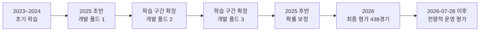
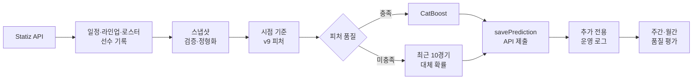

# KBO 홈팀 승리 확률 예측

Statiz API와 2023~2026년 KBO 데이터를 이용해 **경기 시작 전 홈팀 승리 확률을 산출하고 실시간 API로 제출하는 엔드투엔드 데이터 분석 프로젝트**입니다. 데이터 수집부터 시점 기준 피처 생성, 확률 모델 비교, 순차 검증, 운영 로그 평가까지 하나의 재현 가능한 흐름으로 구축했습니다.

> 이 프로젝트의 목표는 단순히 승패를 많이 맞히는 것이 아니라, 실제 예측 시점에 알 수 있는 정보만으로 **해석 가능하고 검증 가능한 확률**을 만드는 것입니다.

## 프로젝트 한눈에 보기

| 구분 | 내용 |
|---|---|
| 프로젝트 형태 | 2인 팀 프로젝트 |
| 분석 기간 | 2023~2026년 정규시즌 |
| 분석 단위 | 경기 1건 |
| 최종 피처 데이터 | 2,608경기 × 66개 열 |
| 예측 목표 | 무승부를 제외한 조건부 홈팀 승리 확률 |
| 운영 모델 | CatBoost 직접 분류기 |
| 검증 방식 | 2025년 순차 개발 폴드 3개 + 2026년 최종 평가 |
| 구현 범위 | API 수집, 정형화, 피처, 모델 비교, 실시간 제출, 운영 평가 |
| 주요 기술 | Python, Pandas, NumPy, CatBoost, scikit-learn, Optuna, statsmodels |

## 핵심 결과

- 2026년 비무승부 438경기에서 CatBoost의 로그 손실은 `0.6846`으로, 고정 홈 승률 기준선의 `0.6930`보다 낮았습니다.
- CatBoost의 정확도는 `56.85%`로 로지스틱 회귀의 `57.31%`보다 낮았지만, 개발 폴드의 로그 손실과 브라이어 점수가 가장 낮아 운영 모델로 선택했습니다.
- 직접 승패 분류, 득점 분포 모델, 고정 확률 기준선을 동일 경기와 동일 확률 지표로 비교했습니다.
- 경기 시작 직전 컷오프를 적용해 같은 경기의 사후 기록이 피처에 섞이지 않도록 설계했습니다.
- 라인업 또는 선수 피처 품질이 부족할 때는 최근 10경기 기반 대체 확률을 사용하고 발동 사유를 기록합니다.

이 결과는 KBO 승패를 높은 확률로 구분했다는 주장이 아닙니다. 2026년 ROC AUC는 `0.5850`으로 판별력은 제한적입니다. 작은 성능 차이를 과장하기보다 **시간 순서가 보존된 평가, 확률 품질 중심의 모델 선택, 운영 이후 검증 가능한 로그 구조**를 구현하는 데 초점을 두었습니다.

## 문제 정의

### 분석 질문

경기 시작 전에 공개되는 일정, 선발, 라인업, 로스터와 과거 선수 기록만으로 홈팀의 조건부 승리 확률을 얼마나 안정적으로 추정할 수 있는가?

### 왜 정확도가 아니라 확률인가

`0.51`과 `0.80`은 같은 홈팀 승리 예측이어도 신뢰 수준이 다릅니다. 실제 의사결정에 필요한 불확실성까지 평가하기 위해 모델 선택 우선순위를 다음과 같이 정의했습니다.

1. 로그 손실
2. 브라이어 점수
3. 보정 절편과 보정 기울기
4. ROC AUC
5. 정확도

API 전송값도 이 정의에 맞춰 `percent = P(홈팀 승리) × 100`으로 고정합니다. 원정팀이 우세하더라도 선택 팀 확률이 아닌 홈팀 승리 확률을 전송합니다.

## 핵심 분석 과제

| 분석 과제 | 위험 | 해결 방식 |
|---|---|---|
| 같은 경기의 사후 기록 유입 | 룩어헤드 편향 | 경기 직전 `feature_cutoff_datetime` 기준 시점 결합 |
| 시즌 초·신규 선수의 소표본 | 극단적인 초기 기록 | 이전 시즌 기록과 리그 사전분포를 이용한 축소 추정 |
| 선발·타선·불펜의 단위 차이 | 선수 역할 혼합 | 라인업·로스터 기반 역할 분리 후 경기 단위 집계 |
| 정확도 중심 모델 선택 | 과신된 확률 선택 | 로그 손실·브라이어·보정 품질 우선 비교 |
| 불완전한 라인업과 API 제한 | 실시간 피처 생성 실패 | 최근 10경기 대체 모델, 제한된 재시도, 사유 로깅 |
| 운영 재현성 부족 | 코드·데이터 버전 추적 불가 | Git 커밋, 체크섬과 배포 ID 기록 |

## 데이터 구성과 분석 단위

| 원천 | 주요 키 | 활용 |
|---|---|---|
| 경기 일정·결과 | `s_no`, 경기 시각, 팀 | 기준 행, 타깃, 시간 컷오프 |
| 경기 라인업 | 경기, 팀, 선수, 포지션, 타순 | 선발 투수와 선발 타자 식별 |
| 팀 로스터 | 날짜, 팀, 선수 | 불펜 후보와 당일 선수 모집단 |
| 선수 일별 기록 | 선수, 시즌, 경기 | 과거 기록과 최근 투구 부담 |
| 선수 시즌 기록 | 선수, 시즌 | 시즌 초 축소 추정 |
| 리그·구장 기준값 | 연도, 구장 | FIP 상수, 타격 환경, 파크 팩터 |

최종 데이터셋은 경기 1건을 하나의 행으로 사용합니다.

| 연도 | 경기 수 |
|---:|---:|
| 2023 | 720 |
| 2024 | 720 |
| 2025 | 720 |
| 2026 | 448 |
| **합계** | **2,608** |

2026년 전체 448경기 중 무승부를 제외한 438경기를 최종 확률 평가에 사용했습니다.

### 원천 데이터 품질 관리

선수 API 응답은 원문 스냅샷을 먼저 보존한 뒤 정형화합니다. 실패 응답은 성공 데이터와 섞지 않고 재수집할 수 있도록 상태를 남깁니다.

| 품질 항목 | 확인 결과 |
|---|---:|
| 선수 일별 원천 스냅샷 | 4,092건 |
| 정형화된 선수-경기 기록 | 81,518건 |
| 선수 일별 중복 키 | 0건 |
| 선수 시즌 원천 스냅샷 | 1,999건 |
| 정형화된 선수-연도 기록 | 1,703건 |
| 선수 시즌 중복 키 | 0건 |
| 파싱 오류 | 0건 |

## 시점 기준 피처 엔지니어링

각 경기의 피처 컷오프를 `game_datetime - 1 microsecond`로 정의하고, 이 시점보다 앞선 관측치만 사용합니다. 학습 데이터와 실시간 추론이 같은 정보 경계를 갖도록 2023~2026년 전체에 동일한 규칙을 적용했습니다.

| 피처 그룹 | 주요 변수 | 설계 |
|---|---|---|
| 선발 투수 | FIP | 라인업의 선발 식별, 현재·이전 시즌 축소 결합 |
| 타선 | OBP, SLG, ISO, BB%, K%, 선형 득점 기여 | 선발 타순 1~9번의 과거 기록 집계 |
| 불펜 | FIP, ERA, K/BB, 후보 수 | 로스터 투수 중 당일 선발 제외 |
| 불펜 피로 | 최근 1일·3일·10경기 이닝과 투구 수 | 컷오프 이전 등판만 롤링 집계 |
| 환경 | 연도별 리그 상수, 구장 팩터 | 해당 경기 이전 기록만 사용 |
| 상대 비교 | 선발·타선·불펜 차이 | 홈 피처에서 원정 피처 차감 |

현재 시즌 표본이 작을수록 이전 시즌과 리그 수준의 비중을 높입니다. 각 피처 그룹에는 `historical_shrunk`, `league_prior`와 같은 출처 정보와 결측 감사 열을 남겨 실시간 품질 판정에 사용합니다.

## 검증 전략

랜덤 분할은 미래 경기가 과거 경기의 학습에 들어갈 수 있어 사용하지 않았습니다. 2025년을 시간 순서의 확장형 개발 폴드로 나누고, 모델 선택과 보정이 끝난 뒤 2026년을 최종 평가했습니다.



| 구간 | 역할 | 모델 선택 사용 여부 |
|---|---|---|
| 2023~2024 | 초기 학습 | 사용 |
| 2025 개발 폴드 1~3 | 하이퍼파라미터와 모델군 비교 | 사용 |
| 2025 후반 | 확률 보정 | 모델 피팅과 분리 |
| 2026 비무승부 438경기 | 최종 공학적 평가 | 사용하지 않음 |
| 2026-07-28 이후 신규 예측 | 고정 배포 전향적 평가 | 운영 의사결정에 사용 |

2026 최종 평가 수치는 운영 후보를 다시 고르기 위한 값이 아닙니다. 전향적 운영 평가는 배포 이후 처음 기록된 경기 전 예측만 대상으로 별도 집계합니다.

## 모델 비교와 선택

| 모델 | 개발 로그 손실 | 개발 브라이어 | 2026 로그 손실 | 2026 브라이어 | 2026 ROC AUC | 정확도 |
|---|---:|---:|---:|---:|---:|---:|
| **CatBoost** | **0.675058** | **0.241126** | **0.684634** | **0.245763** | 0.584988 | 0.568493 |
| 로지스틱 회귀 | 0.718816 | 0.259393 | 0.684957 | 0.245913 | 0.583090 | **0.573059** |
| 음이항 득점 모델 | 0.786685 | 0.274557 | 0.688316 | 0.247589 | **0.598611** | 0.536530 |
| 포아송 CatBoost 득점 모델 | 0.694530 | 0.249909 | 0.692261 | 0.249443 | 0.547584 | 0.547945 |
| 고정 홈 승률 기준선 | 해당 없음 | 해당 없음 | 0.692985 | 0.249919 | 0.500000 | 0.511416 |

CatBoost는 정확도 최고 모델이 아닙니다. 그러나 개발 폴드의 로그 손실과 브라이어 점수가 가장 낮고, 단일 모델이라 운영 경로도 단순합니다. 2026 정확도만 보고 모델을 다시 선택하지 않고 사전에 정한 개발 구간의 확률 품질 기준을 유지했습니다.

### 대체 모델

라인업이 마감 시점까지 완성되지 않거나 주 모델 피처 품질이 기준을 통과하지 못하면 양 팀의 최근 10경기 승률과 고정 학습 구간 홈 승률을 결합합니다.

| 로그 손실 | 브라이어 | 보정 절편 | 보정 기울기 | ROC AUC | 정확도 |
|---:|---:|---:|---:|---:|---:|
| 0.696892 | 0.251696 | 0.068658 | 0.381101 | 0.543302 | 0.548204 |

대체 모델은 높은 성능을 주장하기 위한 모델이 아니라, 불완전한 실시간 입력에서도 예측 과정을 중단하지 않기 위한 운영 안전장치입니다.

## 운영 파이프라인



- 읽기 API에 연결 제한 시간과 제한된 재시도를 적용합니다.
- 쓰기 API는 동일 예측값을 최대 3회까지 재전송합니다.
- 경기 시작 이후에는 신규 예측을 제출하지 않고 오프라인 진단 기록으로 분리합니다.
- 재시작 시 성공적으로 전달됐거나 오프라인 완료된 경기를 복원합니다.
- 최초 예측, 전달 결과, 대체 사유를 기존 행을 수정하지 않고 추가합니다.
- Git 커밋, 모델·데이터·분할 체크섬과 배포 ID를 기록합니다.

## 팀 구성과 담당 역할

이 프로젝트는 **2인 팀 프로젝트**입니다. 아래 항목은 포트폴리오 제출 전에 개인 기여 범위에 맞게 작성할 수 있도록 분리했습니다.

| 항목 | 작성 내용 |
|---|---|
| 담당 영역 | 직접 작성 |
| 주요 구현 및 분석 | 직접 작성 |
| 핵심 의사결정 | 직접 작성 |
| 협업 방식 | 직접 작성 |
| 기여 결과 | 직접 작성 |

## 재현 방법

### 요구 사항과 인증

- Python 3.14
- Statiz API 인증 정보

```bash
python3 -m venv .venv
source .venv/bin/activate
pip install pandas numpy scikit-learn catboost optuna scipy \
  statsmodels joblib requests rich tqdm
cp config/.env.example config/.env
```

[`config/.env.example`](config/.env.example)의 `STATIZ_API_KEY`, `STATIZ_SECRET`, `STATIZ_PTT_IDX`에 로컬 인증값을 입력합니다. `run_pipeline.py`는 `config/.env`를 읽되 이미 셸에 설정된 값을 덮어쓰지 않습니다. 인증값과 개인 식별자는 커밋하지 않습니다.

### 합성 예시 데이터

실제 원천 데이터를 공개하지 않고도 입력 구조를 확인할 수 있도록 고정 시드 42의 144경기 합성 데이터를 제공합니다.

```bash
python3 examples/generate_synthetic_v9_data.py
python3 examples/generate_synthetic_v9_data.py \
  --output data/final/final_training_set_v9.csv
```

합성 데이터는 API 수집과 실제 성능 검증을 대체하지 않습니다. 자세한 범위는 [`examples/README.md`](examples/README.md)를 참고하십시오.

### 일일 운영

```bash
python3 run_pipeline.py
```

현재 일일 파이프라인은 일정 → 종료 경기 라인업 → 로스터 → 당일 선수 스냅샷 → 정형화 → 실시간 예측 순서로 실행됩니다. 모델 튜닝과 전체 재학습은 별도 실행합니다.

### 모델 개발과 평가

```bash
# v9 피처 생성과 모델 튜닝
PYTHONPATH=src/kbo_pipeline:src python3 -m scripts.build.create_feature_matrix_v9
PYTHONPATH=src/kbo_pipeline:src python3 -m scripts.model.tune_hyperparameters

# 직접 분류기·득점 모델 학습과 운영 모델 선택
PYTHONPATH=src/kbo_pipeline:src python3 -m scripts.model.train_classifier
PYTHONPATH=src/kbo_pipeline:src python3 -m scripts.model.train_score_models
PYTHONPATH=src/kbo_pipeline:src python3 -m scripts.model.compare_models

# 최종 백테스트와 전향적 운영 로그 평가
PYTHONPATH=src/kbo_pipeline:src python3 -m scripts.model.backtest
PYTHONPATH=src/kbo_pipeline:src python3 -m scripts.ops.evaluate_prediction_log
```

Optuna 시행 횟수는 `KBO_OPTUNA_TRIALS`로 조정할 수 있으며 모델과 데이터 분할의 난수 시드는 42로 고정합니다.

## 저장소 구조

```text
.
├── run_pipeline.py             # 일일 운영 진입점
├── src/kbo_pipeline/           # 시점 결합·피처·모델·API 공통 모듈
├── scripts/
│   ├── collect/                # 일정·라인업·로스터·선수 수집
│   ├── build/                  # 정형화와 v9 피처 생성
│   ├── model/                  # 튜닝·학습·비교·백테스트
│   └── ops/                    # 실시간 예측과 운영 평가
├── data/
│   ├── raw/                    # API 원천과 누적 경기 데이터
│   ├── processed/              # 선수 기록 정형화 결과
│   └── final/                  # 모델 입력과 시간 분할 명세
├── artifacts/
│   ├── models/                 # 운영 모델과 선택 메타데이터
│   ├── evaluations/            # 모델 비교와 백테스트
│   └── operations/             # 추가 전용 예측 로그
├── examples/                   # 고정 시드 합성 데이터
├── tests/                      # 데이터·모델·운영 계약 테스트
└── docs/                       # 설계·감사·운영 문서
```

## 상세 문서와 산출물

- [파이프라인 운영 문서](docs/pipeline_summary.md)
- [초기 구조의 데이터 누수·평가 위험 검토](docs/adversarial_review_pipeline.md)
- [파이프라인 개선 계획](docs/pipeline_improvement_plan.md)
- [합성 예시 데이터 안내](examples/README.md)
- [모델 비교 결과](artifacts/evaluations/model_comparison_results.csv)
- [운영 모델 메타데이터](artifacts/models/best_model_metadata.json)
- [시간 분할 명세](data/final/time_split_manifest.json)

## 한계와 다음 단계

### 현재 한계

1. **판별력:** 2026 ROC AUC가 `0.5850`이므로 팀 전력과 경기 변동성을 충분히 분리했다고 보기 어렵습니다.
2. **시즌 초:** 표본이 부족한 선수와 불펜은 이전 시즌 또는 리그 사전분포의 영향을 크게 받습니다.
3. **평가 범위:** 2026 최종 평가는 시간 순서 홀드아웃이지만 고정 배포 이후의 전향적 홀드아웃과는 다릅니다.
4. **외부 의존성:** API 호출 제한과 라인업 공개 시점에 따라 대체 모델이 사용될 수 있습니다.
5. **데이터 공개:** 완전한 재현은 Statiz API 정책과 데이터 사용 권한을 따라야 합니다.

### 다음 단계

- 고정 배포 이후 최소 300경기의 전향적 예측 표본 축적
- 주간·월간 로그 손실과 브라이어 차이의 신뢰구간 모니터링
- 시즌 구간과 결측 출처별 확률 보정·오차 분석
- 대체 모델 사용률과 API 저장 성공률을 포함한 운영 품질 관리
