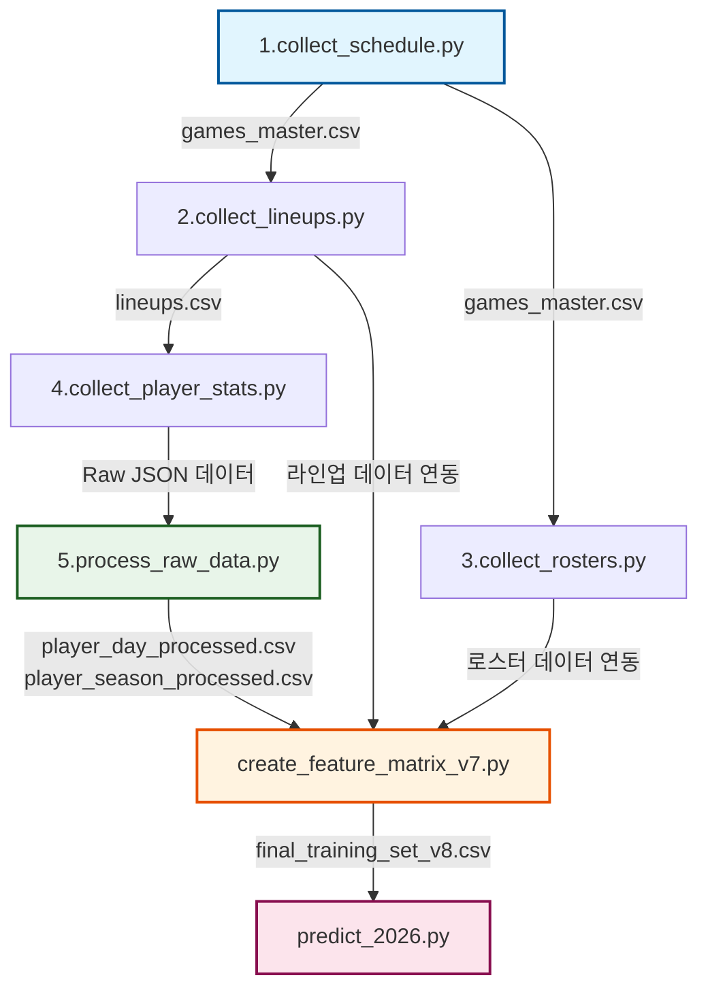

# ⚾ KBO 예측 시스템 파이프라인 구성 문서 (v1.2)

본 문서는 `run_pipeline.py`를 중심으로 작동하는 KBO 경기 예측 시스템의 전체 데이터 파이프라인 구조와 각 단계별 스크립트의 역할을 정리한 문서입니다.

---

## 📌 1. 전체 파이프라인 워크플로우 (Workflow)

전체 시스템은 **데이터 수집 ➔ 전처리 및 데이터 복구 ➔ 피처 엔지니어링 ➔ 앙상블 학습 및 실시간 예측**의 4대 단계, 총 7개의 세부 스크립트로 구성됩니다.

---

## 📂 2. 단계별 스크립트 상세 설명

### [Step 1] 경기 일정 및 결과 수집 (`1.collect_schedule.py`)
*   **역할**: 2023년부터 현재 연도까지의 KBO 정규시즌 경기 일정 및 결과(스코어 포함)를 수집합니다.
*   **API 호출**: Statiz API - `prediction/gameSchedule` (연도/월별 호출)
*   **데이터 필터링**: 정규시즌 경기(`leagueType == '10100'`)만 필터링합니다.
*   **입출력**:
    *   **Output**: `data/raw/games_master.csv`
*   **특이사항**: 중복 데이터는 `s_no`(경기 일련번호) 기준으로 제거하며, 가장 최근 수집된 데이터(경기 완료 후 업데이트된 스코어 포함)를 유지합니다.

### [Step 2] 선발 라인업 수집 (`2.collect_lineups.py`)
*   **역할**: `games_master.csv`에서 이미 완료된 경기(스코어가 기록된 경기)의 실제 선발 라인업을 수집합니다.
*   **API 호출**: Statiz API - `prediction/gameLineup` (경기 s_no별 호출)
*   **입출력**:
    *   **Input**: `data/raw/games_master.csv`
    *   **Output**: `data/raw/lineups.csv`
*   **특이사항**: 매번 전체를 다시 받는 것이 아니라, 기존에 수집된 경기 ID를 제외한 신규 완료 경기만 부분 수집(Incremental Update)합니다.

### [Step 3] 팀 로스터 정보 동기화 (`3.collect_rosters.py`)
*   **역할**: 경기일에 등록되어 있던 양 팀의 선수 로스터 정보를 수집합니다.
*   **API 호출**: Statiz API - `prediction/playerRoster` (팀 코드 및 날짜별 호출)
*   **입출력**:
    *   **Input**: `data/raw/games_master.csv`
    *   **Output**: `data/raw/rosters.csv`
*   **특이사항**: 경기 일정에 등장하는 모든 날짜와 팀 코드의 고유 조합을 추출한 뒤, 기존 수집 건을 제외하고 API를 호출합니다. API 과호출 방지를 위해 Rate Limit(429) 처리 로직이 포함되어 있습니다.

### [Step 4] 선수별 상세 스탯 수집 (`4.collect_player_stats.py`)
*   **역할**: 라인업에 등장하는 모든 선수(`p_no`)의 시즌별 누적 스탯 및 일별 스탯을 수집합니다.
*   **API 호출**: Statiz API - `prediction/playerSeason`, `prediction/playerDay` (선수 p_no 및 연도별 호출)
*   **입출력**:
    *   **Input**: `data/raw/lineups.csv`
    *   **Output**: 
        *   `data/raw/players/playerSeason_2023_2026.csv`
        *   `data/raw/players/playerDay_2023_2026.csv`
*   **특이사항**: 수집 진행 상황을 `progress_players.json`에 기록하여 중단 시에도 이어서 수집이 가능하도록 구현되어 있습니다.

### [Step 5] 원천 데이터 전처리 및 자가 복구 (`5.process_raw_data.py`)
*   **역할**: 수집된 원천 JSON 데이터를 관계형 데이터프레임(CSV) 형태로 파싱 및 정형화하고, 결측치를 복구합니다.
*   **입출력**:
    *   **Input**: `data/raw/players/` 폴더 내 원천 데이터
    *   **Output**: 
        *   `data/processed/player_day_processed.csv` (일별 성적)
        *   `data/processed/player_season_processed.csv` (시즌 성적)
*   **주요 변환 및 복구 로직**:
    *   투수 FIP(Fielding Independent Pitching) 계산: 
        $$\text{FIP} = \frac{13 \times \text{HR} + 3 \times (\text{BB} + \text{HP}) - 2 \times \text{SO}}{\text{IP}} + 3.10$$
    *   **데이터 자가 복구(Self-Healing)**: 일부 선수의 누적 시즌 데이터가 누락되었을 경우, 일별 데이터(`player_day_processed.csv`)의 스탯을 연도별로 직접 집계(Groupby Sum)하여 시즌 성적 데이터를 자동으로 생성해 채워 넣습니다.

### [Step 6] 피처 매트릭스 생성 (`create_feature_matrix_v7.py`)
*   **역할**: 머신러닝 학습과 예측에 사용될 최종 독립변수(Features)와 종속변수(Scores)를 결합하여 피처 매트릭스를 빌드합니다.
*   **입출력**:
    *   **Input**: `games_master.csv`, `lineups.csv`, `rosters.csv`, 전처리된 일별/시즌 성적
    *   **Output**: `data/final/final_training_set_v8.csv`
*   **핵심 피처 엔지니어링**:
    *   **구장 파크 팩터(Park Factor)**: 구장 코드별 고유 파크 팩터 적용 (예: 대구 0.95, 잠실 1.02 등)
    *   **투수 하이브리드 FIP**: 선발 투수의 현재 시즌 일별 누적 FIP와 직전 시즌 FIP를 투구 이닝(IP) 수에 따라 가중 블렌딩합니다.
        *   투구 이닝이 5이닝 미만일 경우 이전 시즌 성적을 크게 반영하며, 5이닝 이상 소화 시 현재 시즌 성적을 100% 반영합니다.
    *   **타자 하이브리드 wRC**: 라인업에 등장하는 타자들의 누적 OBP(출루율)를 바탕으로 현재 wRC를 계산하고, 직전 시즌 wRC+와 타석(PA) 수에 따라 가중 블렌딩합니다. (10타석 이상 소화 시 현재 성적 100% 반영)
    *   **팀 불펜 롤링 스탯**: 구원 투수(포지션 $\neq$ 1)들의 경기 데이터를 취합하여, 각 팀의 최근 10경기 불펜 평균자책점(ERA), FIP, 삼진/볼넷 비율(K/BB)을 롤링 윈도우로 계산합니다.
    *   **최종 피처 차이 변수**: 홈/어웨이 선발 FIP 차이(`sp_fip_diff`), 불펜 ERA 차이(`rp_era_diff`), 타선 파워 차이(`batting_diff`) 및 가중 합산인 `total_diff`를 생성합니다.

### [Step 7] 실시간 승패 예측 시스템 가동 (`predict_2026.py`)
*   **역할**: 앙상블 모델을 학습시키고, 당일 실시간으로 Statiz에서 라인업이 등록되면 예측을 수행해 결과를 API로 전송하는 무한 루프 시스템입니다.
*   **예측 모델 구조**:
    *   **4종 앙상블**: CatBoost, XGBoost, LightGBM, Ridge Regressor
    *   각 모델은 `homeScore`와 `awayScore`를 각각 예측하도록 학습됩니다.
    *   `best_hyperparameters.csv`에 저장된 최적 하이퍼파라미터와 연도별 샘플 가중치를 적용하여 사전 학습을 마칩니다.
*   **확률 산출 방식**:
    *   앙상블 모델들이 예측한 홈 득점 기댓값($\mu_{home}$)과 어웨이 득점 기댓값($\mu_{away}$)을 바탕으로 **Skellam 분포**를 적용하여 홈팀의 승리 확률 및 어웨이팀의 승리 확률을 도출합니다.
*   **프로세스 흐름**:
    1.  오늘 경기 일정 조회 (API: `prediction/gameSchedule`)
    2.  경기별 선발 라인업 실시간 감시 (API: `prediction/gameLineup`)
    3.  양 팀의 라인업이 모두 등록(각 9명 이상)되면 피처 매트릭스를 즉석에서 병합 및 생성.
    4.  학습된 4종 모델에 입력하여 승리 확률 계산.
    5.  결과 저장 API 호출 (`prediction/savePrediction`)하여 서버에 예측 데이터 전송.
    6.  완료된 경기는 세트에 추가하여 제외하고, 60초마다 루프 반복.

---

## 🔄 3. 데이터 파이프라인 입출력 요약 표

| 단계 | 실행 스크립트 | 입력 데이터 | 출력 데이터 (산출물) | 주요 API 엔드포인트 |
| :--- | :--- | :--- | :--- | :--- |
| **1** | `1.collect_schedule.py` | 없음 (새 파일 생성/누적) | `data/raw/games_master.csv` | `prediction/gameSchedule` |
| **2** | `2.collect_lineups.py` | `games_master.csv` | `data/raw/lineups.csv` | `prediction/gameLineup` |
| **3** | `3.collect_rosters.py` | `games_master.csv` | `data/raw/rosters.csv` | `prediction/playerRoster` |
| **4** | `4.collect_player_stats.py` | `lineups.csv` | `playerSeason_2023_2026.csv` `playerDay_2023_2026.csv` | `prediction/playerSeason` `prediction/playerDay` |
| **5** | `5.process_raw_data.py` | `playerSeason_2023_2026.csv` `playerDay_2023_2026.csv` | `player_day_processed.csv` `player_season_processed.csv` | 없음 (로컬 전처리) |
| **6** | `create_feature_matrix_v7.py`| `games_master.csv`, `lineups.csv` `rosters.csv`, 전처리 데이터 | `data/final/final_training_set_v8.csv` | 없음 (로컬 피처 빌드) |
| **7** | `predict_2026.py` | `final_training_set_v8.csv` `best_hyperparameters.csv` | 예측 결과 API 전송 | `prediction/gameSchedule` `prediction/gameLineup` `prediction/savePrediction` |
